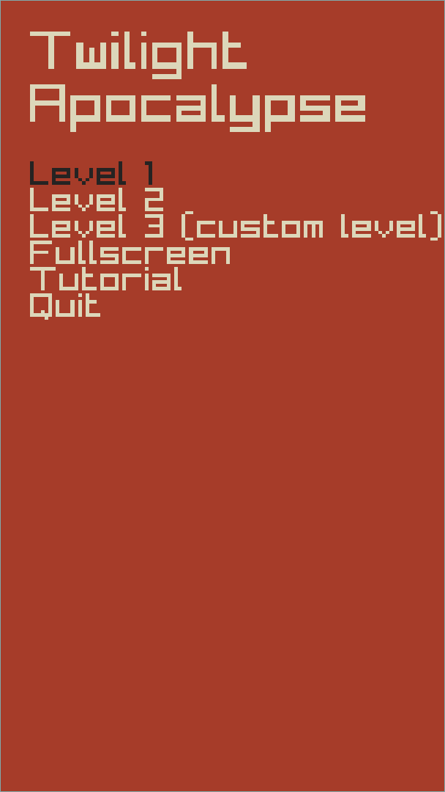
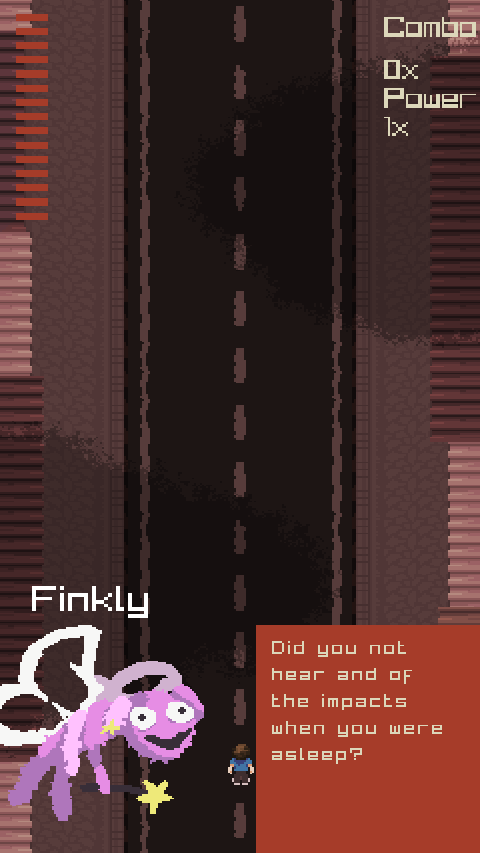
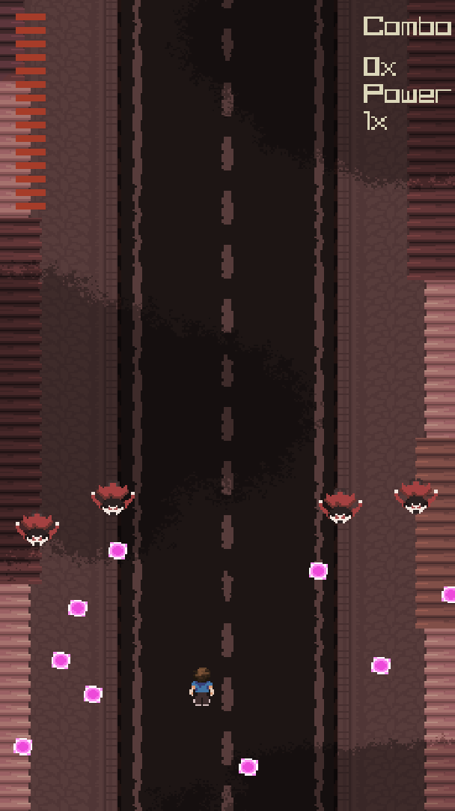
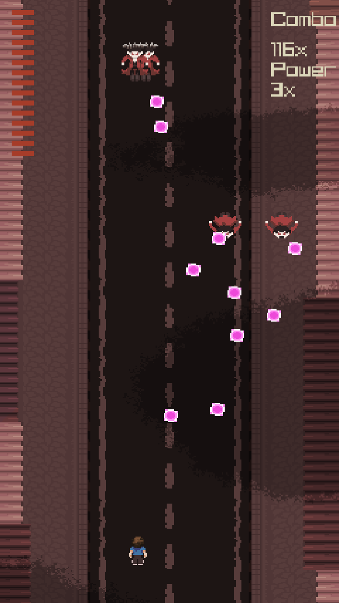

# Unnamed Raylib Shoot 'em Up

A shoot em up game made in c using raylib.

Web build available on [itch.io](https://lochi-makes-games.itch.io/twilight-apocalypse).

## Motivation

This was my first experience learning and using both the c programming language and the raylib game framework.

## Features

- Dialogue system with a story
- 2 levels
- Customisable level with documented level file format
- Full graphics

## How To Play

### Controls

| Keys                         | Action                                          |
| ---------------------------- | ----------------------------------------------- |
| WASD/Arrow keys              | Move                                            |
| W, S, Up arrow or Down arrow | Navigate menus                                  |
| Enter                        | Select menu item/progress dialogue              |
| J or Z                       | Shoot                                           |
| Shift or K                   | Focus Mode (slows you down and focuses bullets) |

## Screenshots

## Level Format

Levels are stored in text files.

Each line can either call a command or create a wave of enemies.

    disallowshoot
    scrollstop
    say f "Hello???
    say m "Hello.
    allowshoot
    scrollstart

This level code disables shooting, stops the screen and says first from the character labelled in the code as 'f' "Hello???", then it says from 'm' "Hello.". The actual names of these characters are defined in namemappings.h

    dart 100 50,spray 200 150,shoot 120 20
    spray 100 50

Each line defining types of enemies, separate each enemy with a comma. The first word chooses a type (defined in enemytypes.c) the other two values are x and y positions.

## Tested Platforms

Tested most thoroughly on Arch Linux.

| Platform   | Arch | Tested os version   |
| ---------- | ---- | ------------------- |
| Arch Linux | x86  | Up-to-date 25/06/26 |

## Technologies

- [Raylib](https://www.raylib.com/)
- C
- [jsfxr sound effects](https://sfxr.me/)

## AI Use

No ai was used in this project. Some code was used from raylib's examples.
